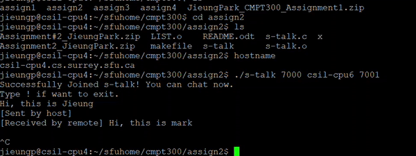

# Simple Chat
S-talk is a simple chat application using kernel level threads implementation for LINUX.  
Two different users running the program at each terminal connects the users into a chat room.

## Technology
Language Used: C

## Setup
1) Download all files into a folder  
2) Run ```command prompt``` in that folder  
3) Run the command **make**  
4) Must enter correct four arguments with spaces between them to run the program:
- **./s-talk my-port-number remote-hostname remote-port-number**
  - my-port-number is any number chosen by the user
  - remote-hostname is hostname of another user
    - To see the hostname, run the command ```hostname``` in command prompt
  - remote-port-numbre is any number chosen by another user

## pthread Environments
Four threads:
- 1) Input from keyboard
- 2) Nothing other than await UDP datagram
- 3) Prints message on screen
- 4) Send data over the network using UDP

## Demo

